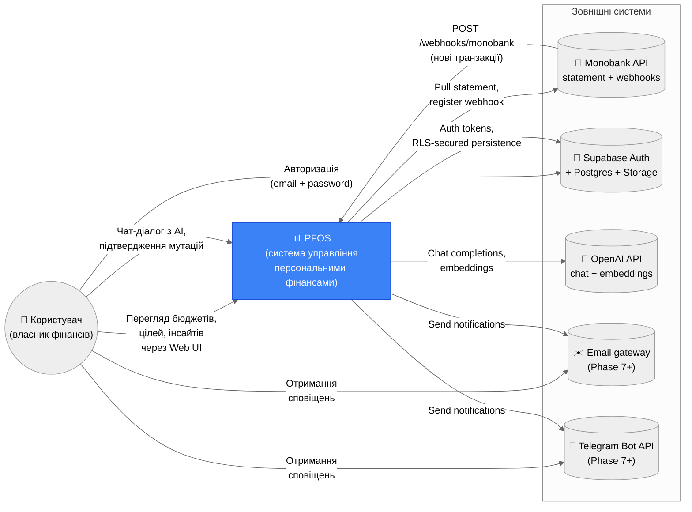

# C4 — System Context

System Context view of PFOS (Personal Financial Operating System).

## Stakeholders

| Actor | Role |
|---|---|
| **Користувач** | Особа, яка планує бюджети, ставить цілі, читає рекомендації, спілкується з AI |
| **Monobank API** | Postavalнік транзакцій (PFOS — read-only пасивний споживач) |
| **Supabase** | Identity & RLS-захищене сховище (Auth + Postgres + (опційно) Storage) |
| **OpenAI** | LLM-провайдер (chat-completions для агентів + embeddings для memory/recommendations) |
| **Email/Telegram** | Опціональні канали delivery (зараз stubs у `notifications/channels`) |

## Out-of-scope

- Інтеграція з податковою / банками крім Monobank
- Investment broker APIs
- Crypto wallet sync
- Multi-tenant (B2B) сценарії
