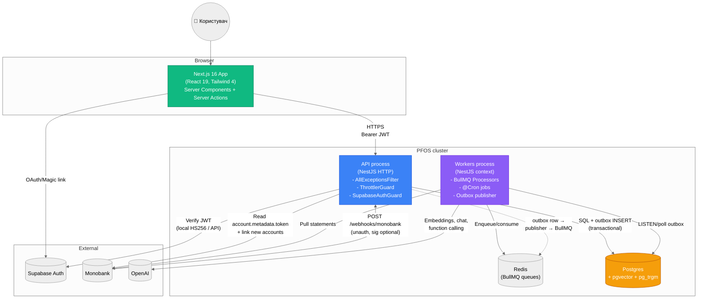

# C4 — Containers

Container view: процеси / сервіси та як вони комунікують.

## Process responsibilities

### API process (`backend/src/main.ts`)
- HTTP REST + Swagger
- Supabase JWT verification (hybrid: local HS256 → fallback `auth.getUser`)
- Domain mutations + outbox writes (single transaction)
- ThrottlerGuard глобально (`default` 120/min, `ai` 10/min)
- AllExceptionsFilter — uniform error JSON

### Workers process (`backend/src/workers/main.ts`)
- BullMQ Processors на 14 queues (categorization, budgets, rules, recommendations, notifications, ai-memory, …)
- @Cron jobs (cashflow refresh, memory consolidation, recommendation pipeline, traits refresh, notification delivery)
- OutboxPublisher: 1s polling → BullMQ enqueue → mark processed
- Single replica (deduplication burden ON; can scale per-queue if needed)

### Redis
- BullMQ backplane (jobs, schedules, dead-letter queue)
- Не використовується як cache — стан тримається у Postgres

### Postgres
- Усі агрегати (transactions, budgets, goals, cashflow, recommendations, …)
- pgvector для memory + recommendation embeddings (HNSW index)
- pg_trgm для fuzzy text search
- Domain events table + outbox table (transactional)
- RLS policies заборонено для сервіс-роль; user_id-фільтрація в application layer
