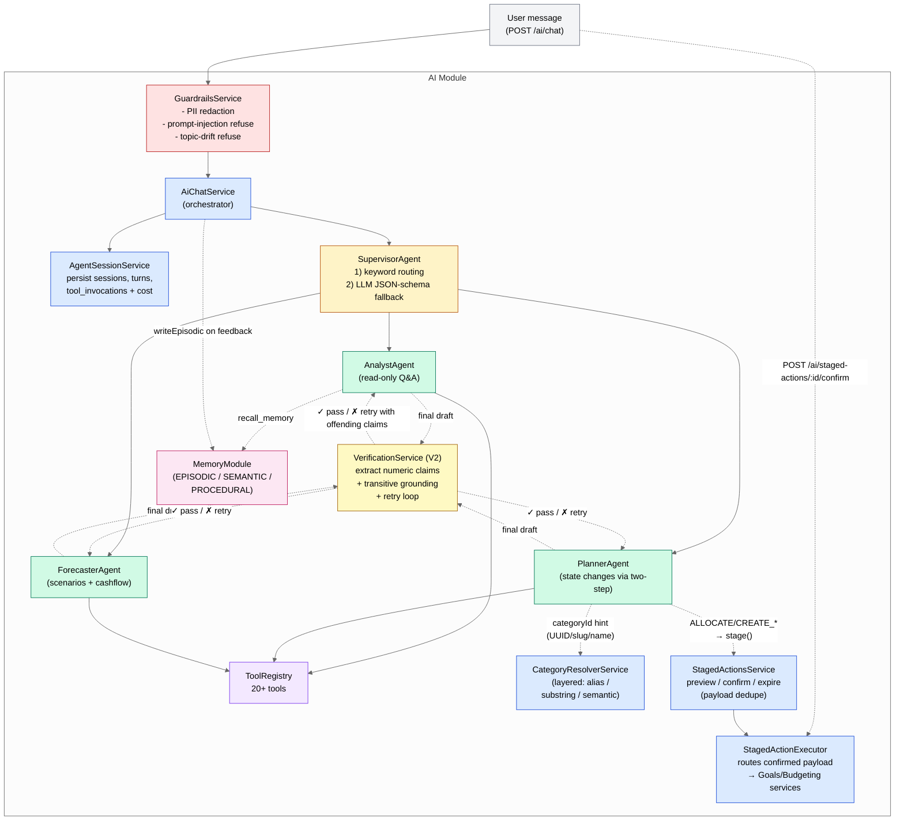
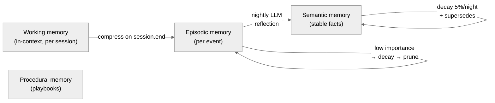

# C4 — Components: AI Cognition Context

Internal structure of the AI module: supervisor + sub-agents + tool catalog
+ memory layer + guardrails.

## Tool subset per agent (актуально на момент thesis)

| Agent | Read | Cognitive / Memory | Mutation |
|---|---|---|---|
| Analyst | get_budgets, get_categories, get_goals, get_cashflow, get_recommendations, get_transactions, get_subscriptions, get_fx_rate | get_cashflow_summary, explain_recommendation, **explain_spending_change** (V3), **lookup_education** (RAG), **calculate**, recall_memory | — |
| Planner | get_goals, get_budgets, get_categories, get_recommendations, get_fx_rate | **lookup_education** (RAG), **calculate**, recall_memory | create_goal, **create_budget**, **add_budget_line**, **archive_budget**, contribute_to_goal, adjust_budget_line, accept_recommendation, snooze_recommendation |
| Forecaster | get_cashflow, get_cashflow_summary, get_goals, get_fx_rate | run_scenario, **lookup_education** (RAG), **calculate**, recall_memory | — |

**Жирним** — нові tools, додані пізніше у Phase 4–6 (V2/V3/RAG).

Усі mutation tools повертають `CONFIRMATION_REQUIRED + stagedActionId`; реальна мутація відбувається коли user викликає `POST /ai/staged-actions/:id/confirm`.

## Memory layer

- Реалізація reflection: [`MemoryConsolidationService`](backend/src/modules/ai/memory/application/consolidation.service.ts) — крон @ 03:00 UTC
- Decay: [`MemoryDecayService`](backend/src/modules/ai/memory/application/decay.service.ts) — крон @ 04:00 UTC
- Procedural memory зберігається через `Playbook` модель і поки що population manual / TBD у Phase 8
