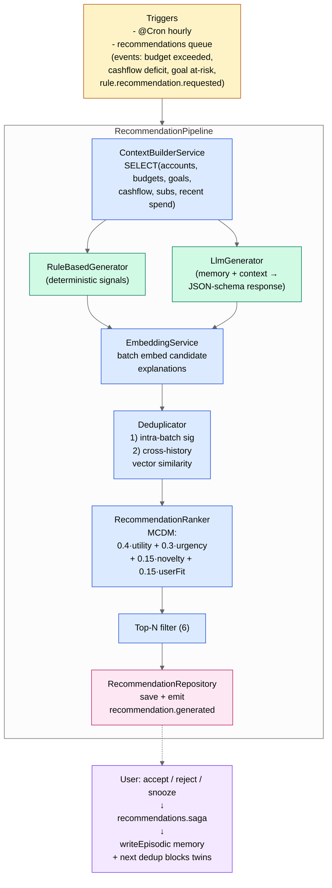

# C4 — Components: Recommendation Engine



## Generator characteristics

| | RuleBasedGenerator | LlmGenerator |
|---|---|---|
| Latency | < 50ms (pure SQL) | 800-2500ms (LLM call) |
| Cost | $0 | ~$0.0001 per run (gpt-4o-mini) |
| Output kinds | BUDGET / CASHFLOW / GOAL / SUBSCRIPTION | SPENDING / SAVING / BEHAVIORAL |
| Determinism | повний | стохастичний (temp=0.5) |
| Bypass when | завжди працює | OPENAI_API_KEY не set → returns [] |

## Ranking formula

```
total = w_utility · utility(c) + w_urgency · urgency(c)
      + w_novelty · novelty(c) + w_userFit · user_fit(c)

де:
  utility   ∈ [0,1] — financial impact (cap 10000 ₴ → 1.0)
  urgency   ∈ [0,1] — derived from priority + days_until_expiration
  novelty   = 1 − max_similarity_to_recent_30d
  user_fit  = cosine(c.embedding, accepted_centroid)

weights default: { 0.4, 0.3, 0.15, 0.15 }
```

Вагові коефіцієнти зберігаються у `RankingScore.weights` поряд з breakdown — UI показує їх на запит "Чому саме ця рекомендація?".

## Closed feedback loop

1. User натискає `Accept` → `recommendation.accepted` подія через outbox
2. `RecommendationsSaga` (queue: `recommendations`) ловить подію → пише episodic memory ("user accepted X kind Y")
3. Наступна `recall_memory` викличе цю запис → LLM-generator адаптує рекомендації
4. `acceptedCentroid()` оновлюється → `userFit` ранжування зміщується до прийнятих профілів

Описати у роботі як *"hybrid recommender з explicit feedback loop та adaptive personalization через memory"*.
