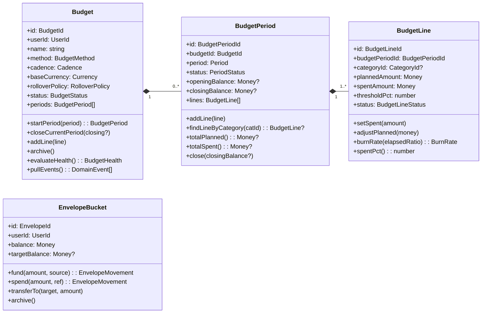
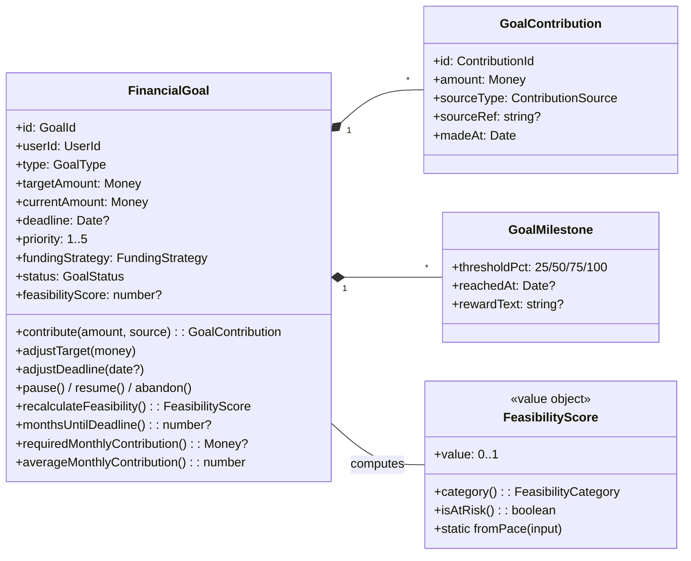
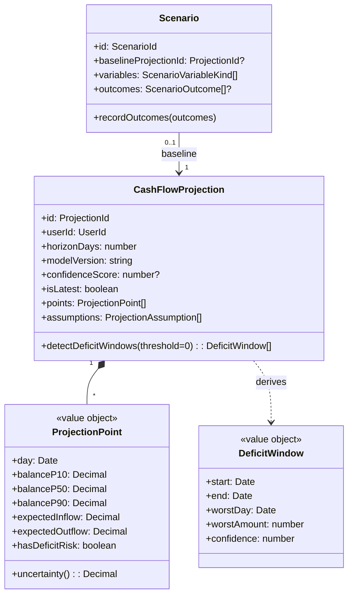
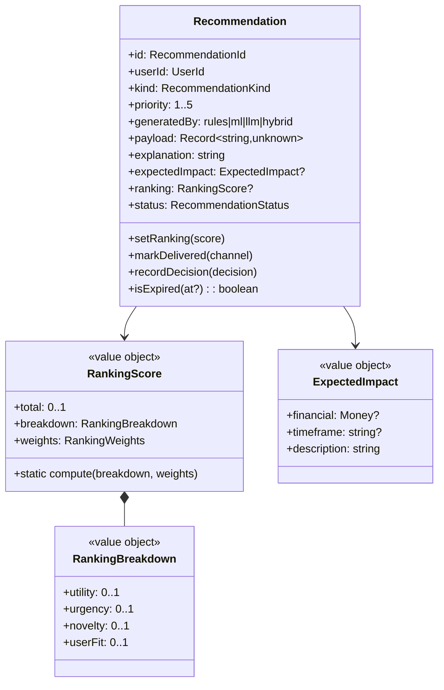
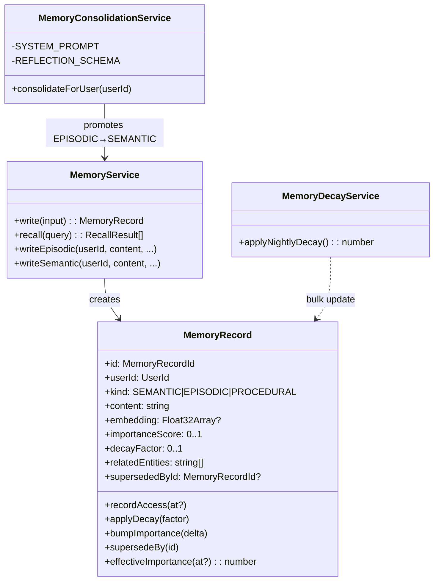

# Class Diagrams (per Bounded Context)

UML-style class diagrams for the core aggregates. Generated from the actual entity classes in `backend/src/modules/*/domain/`.

## Budgeting

**File anchors:**
- [`Budget`](backend/src/modules/budgeting/domain/budget.entity.ts)
- [`BudgetPeriod`](backend/src/modules/budgeting/domain/budget-period.entity.ts)
- [`BudgetLine`](backend/src/modules/budgeting/domain/budget-line.entity.ts)
- [`EnvelopeBucket`](backend/src/modules/budgeting/domain/envelope.entity.ts)

---

## Goals

---

## Cashflow

---

## Recommendations

---

## AI Memory

