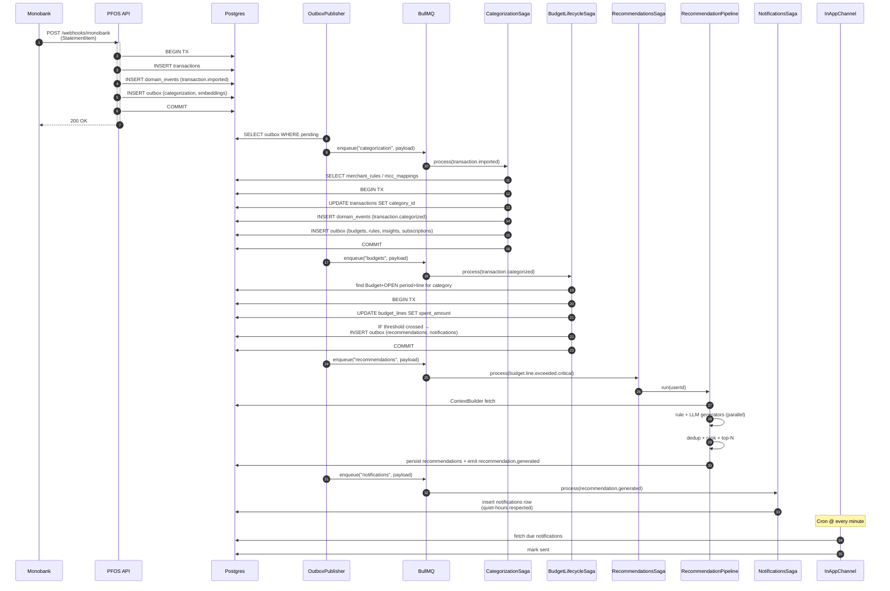
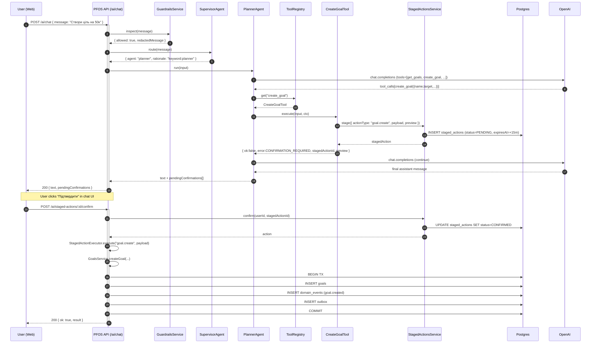
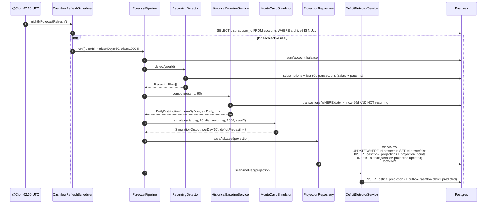
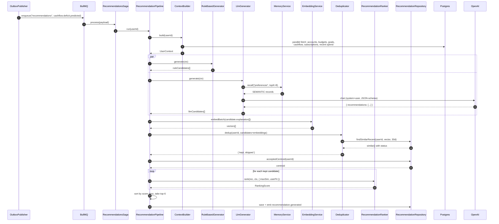
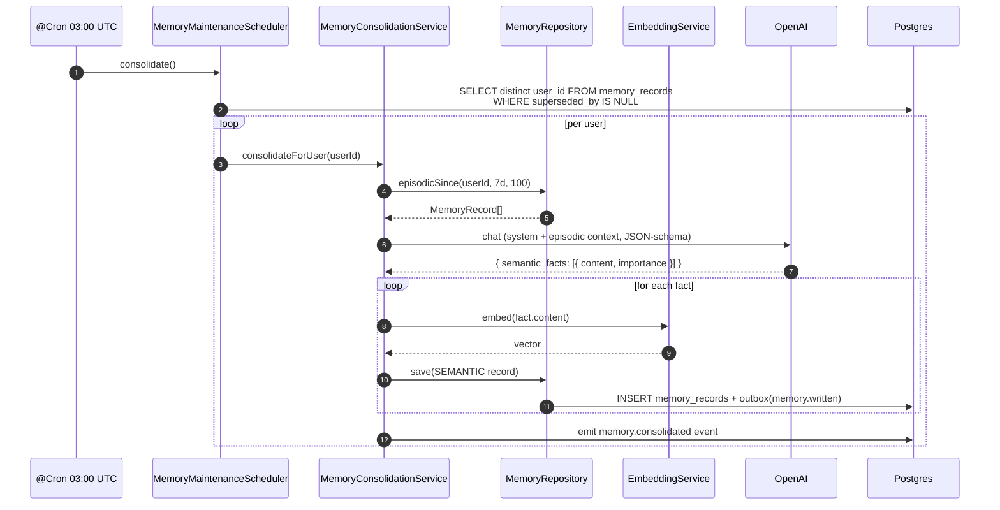
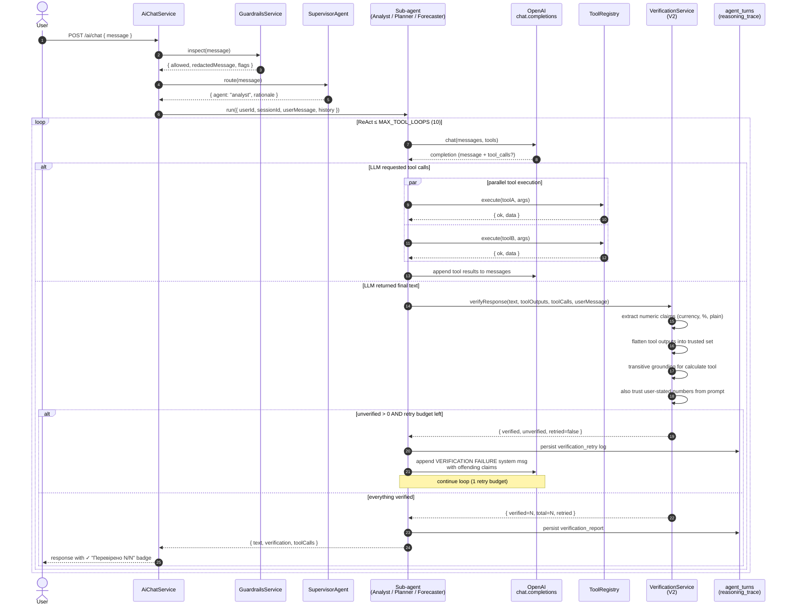
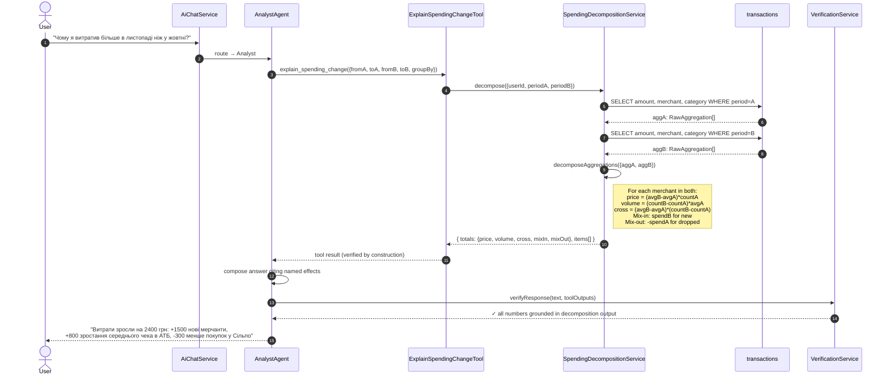

# Sequence Diagrams (Key Flows)

Five flows that exercise the most architecturally interesting paths.

## 1. Transaction ingest → categorization → budget update → recommendation

---

## 2. AI Chat with two-step confirmation

---

## 3. Cashflow forecast pipeline (Monte Carlo + deficit detection)

---

## 4. Recommendation pipeline (event-driven path)

---

## 5. Memory consolidation (nightly LLM reflection)

## 4. AI chat with V2 verification layer

Цей sequence — ключова **наукова новизна** магістерської. Кожне число у
фінальній відповіді LLM трасується назад до якогось tool-output; якщо
число "вигадане" — система автоматично робить retry з корекційним
system-prompt.

Ключові інваріанти, що формалізує цей механізм:

1. **Provenance**: ∀ numeric claim c ∈ response, ∃ tool-call t такий, що c ∈ output(t).
2. **Transitive grounding**: для t = calculate(expr), всі літерали з expr самі мають
   бути ∈ output(t') для якогось іншого t' ≠ calculate, або належати множині чисел,
   які користувач явно вказав у запиті.
3. **Retry safety**: ≤ 1 retry за turn, щоб уникнути нескінченного циклу
   "вигадав → переписав → знов вигадав".

## 5. Causal decomposition (V3) — explain spending change

Властивість, яку V3 гарантує:

**Δspend ≡ priceEffect + volumeEffect + crossEffect + mixInEffect + mixOutEffect** (точно)

Перевірено на 6 синтетичних сценаріях з ground truth — див. `eval/v3-validation.csv`.
