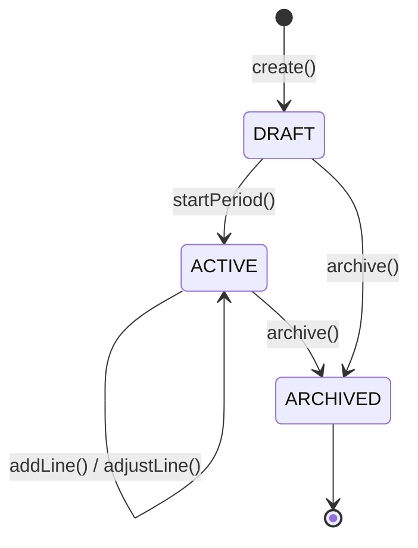
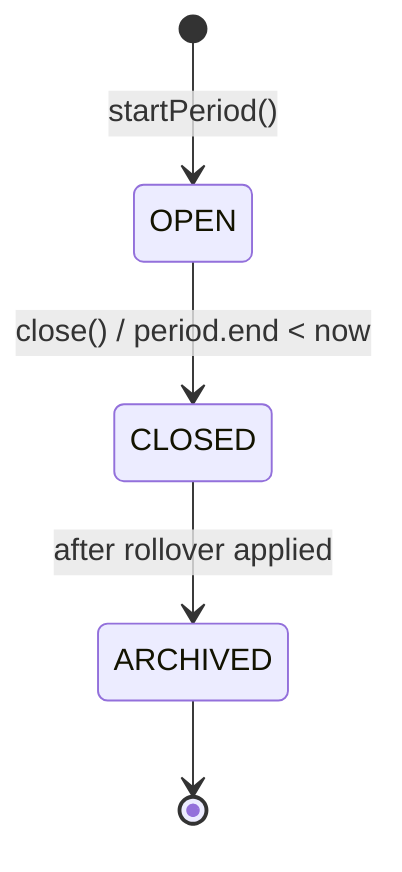
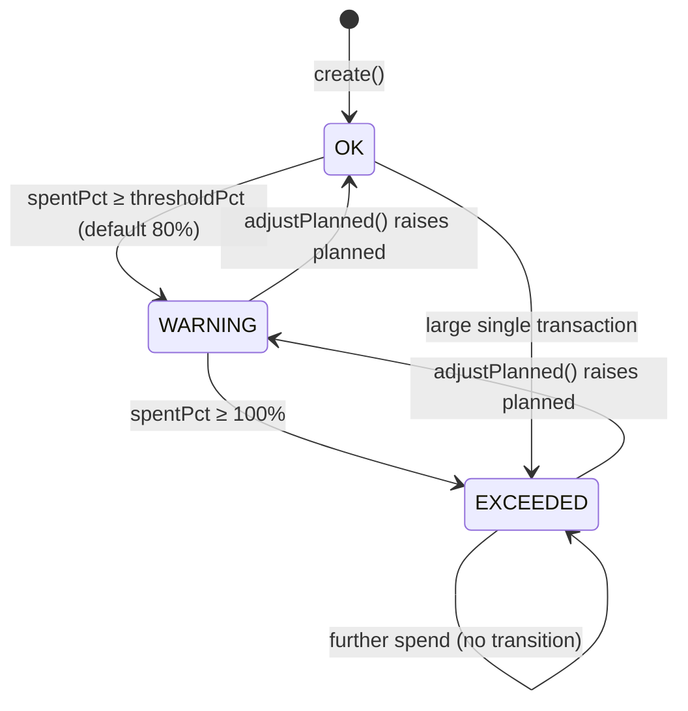
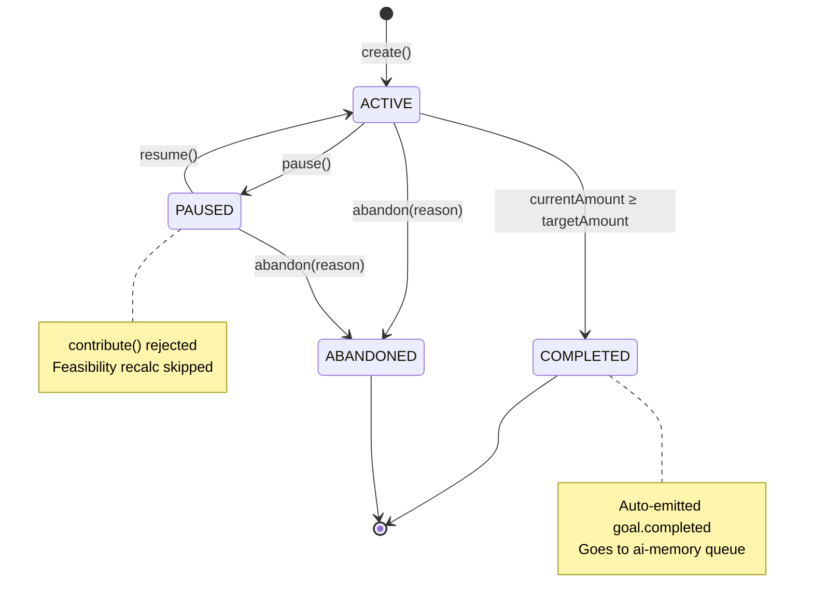
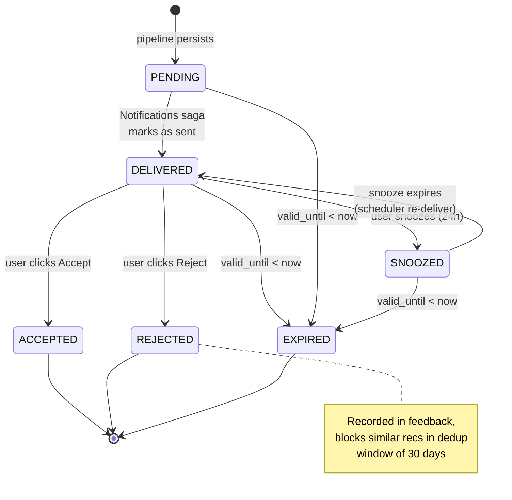
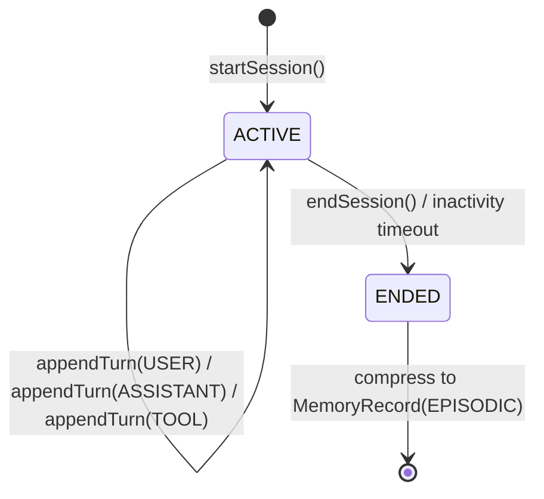
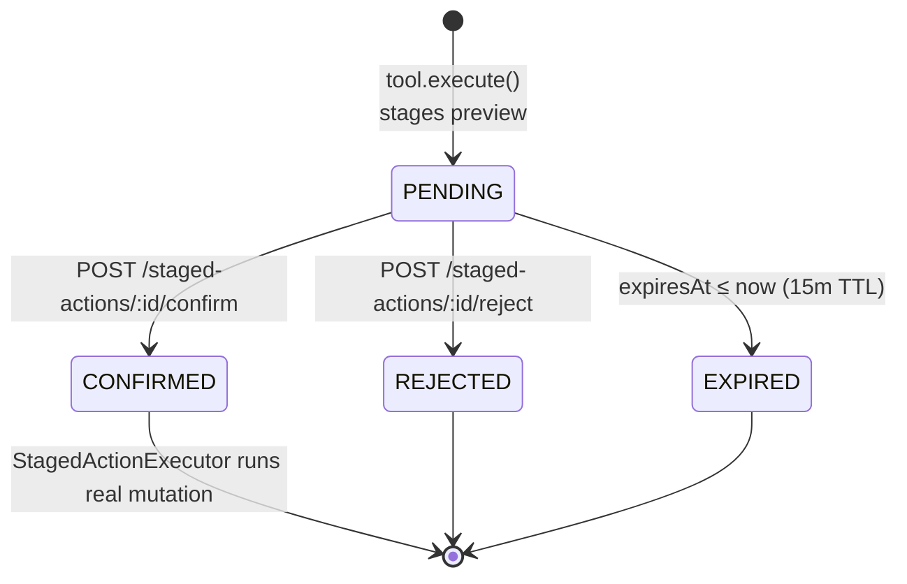
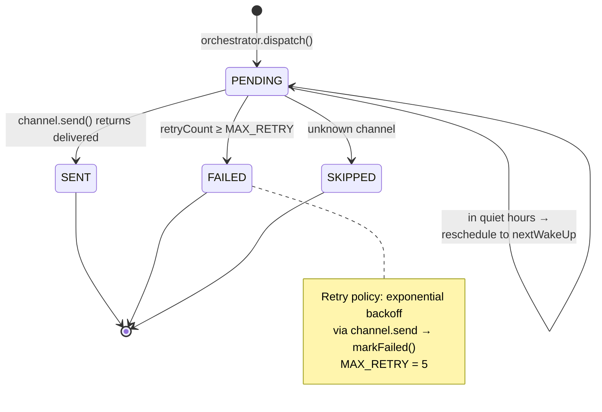
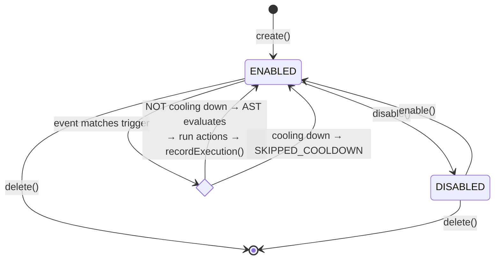

# State Diagrams (FSM Aggregates)

State machines for the aggregates that have explicit lifecycles.

## Budget

State transitions:
- `DRAFT` — створено, але не відкрито жодного періоду; не приймає transactions
- `ACTIVE` — є open period; saga оновлює `spentAmount` lines на кожен `transaction.categorized`
- `ARCHIVED` — soft-delete; історія залишається, нові transactions не зачіпають

---

## BudgetPeriod

**Rollover policies** (declared on `Budget.rolloverPolicy`):
- `RESET` — `closingBalance = 0`, наступний період стартує з нуля
- `CARRY_OVER` — `unspent = planned − spent` переходить у opening наступного періоду
- `PARTIAL` — half goes to next period, half to envelope (TBD)

---

## BudgetLine

Each transition emits `budget.line.exceeded.warning` / `budget.line.exceeded.critical` events through the outbox.

---

## FinancialGoal

---

## Recommendation

---

## AgentSession

Each turn carries `tokensIn`, `tokensOut`, `costUsd` — rolled up to session totals atomically in [`AgentSessionService.appendTurn`](backend/src/modules/ai/orchestration/agent-session.service.ts).

---

## StagedAction (two-step confirmation)

---

## Notification

---

## Rule

