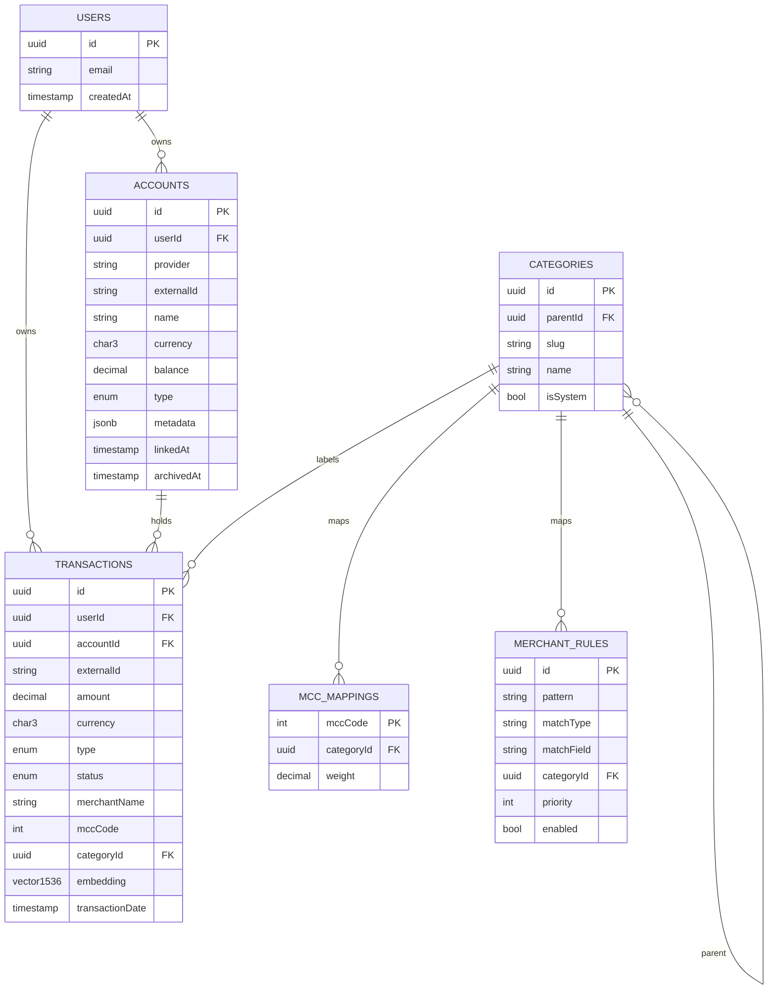
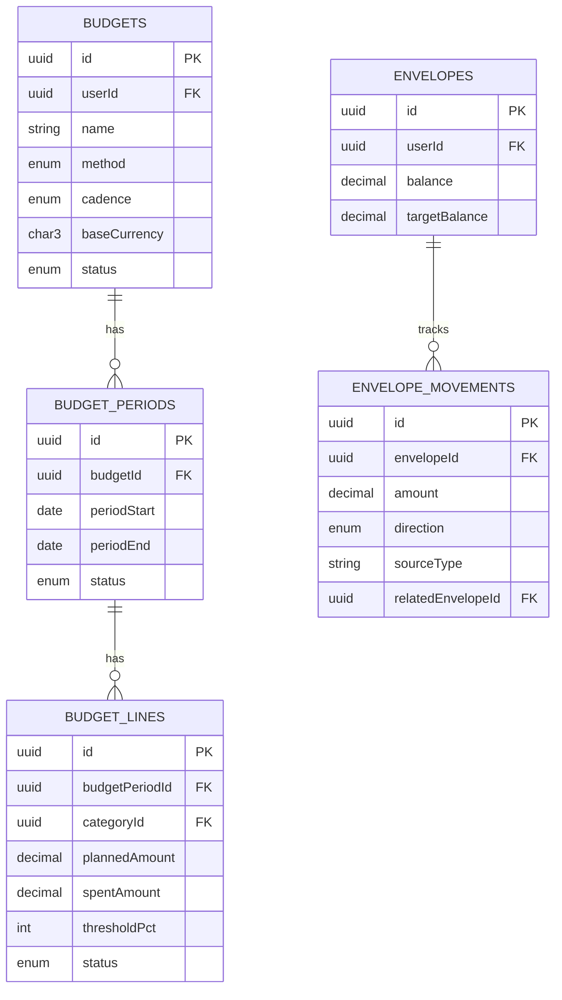
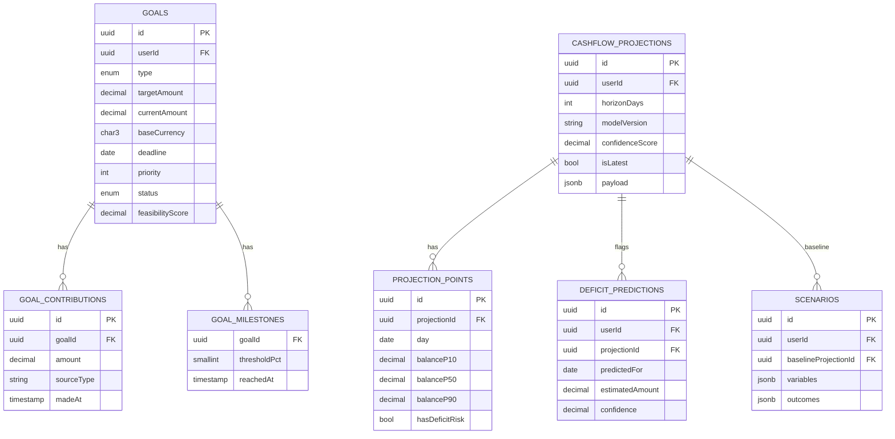
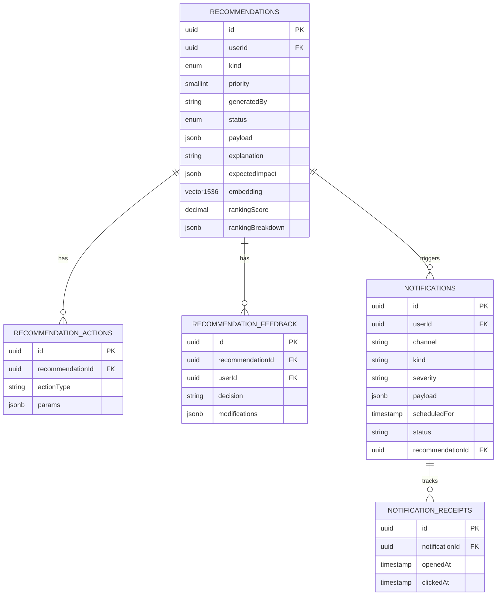
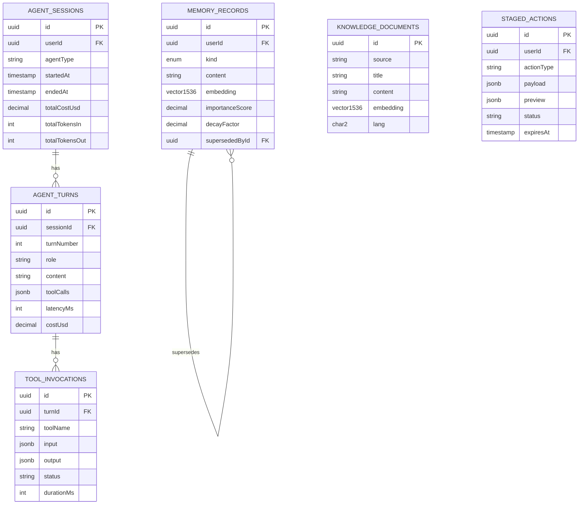
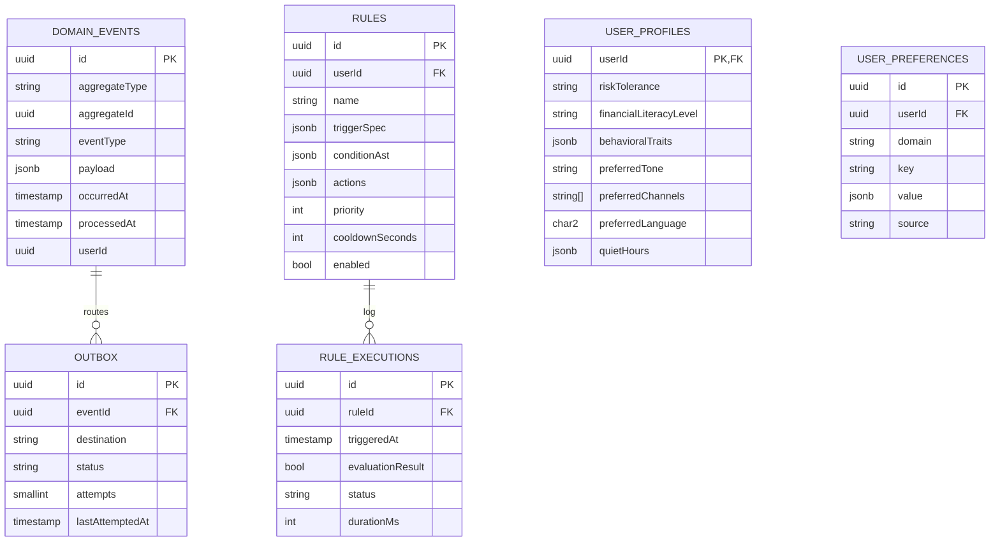

# ER Diagram

Logical schema generated from `prisma/schema.prisma`. Grouped by bounded context.

> Mermaid renders large ER diagrams slowly; if you need it for the thesis, generate a PNG export with the [Mermaid CLI](https://github.com/mermaid-js/mermaid-cli) or [mermaid.live](https://mermaid.live).

## Identity / Accounts / Transactions

## Budgeting

## Goals & Cashflow

## Recommendations & Notifications

## AI Cognition

## Events / Outbox / Rules / Personalization

---

## Key indices

| Table | Index | Reason |
|---|---|---|
| `transactions` | `(userId, transactionDate DESC)` + `(categoryId)` + partial `(userId, isAnomaly)` | feed, analytics, anomaly UI |
| `outbox` | `(status, createdAt)` | publisher draining loop |
| `domain_events` | `(processedAt)` partial | fast lookup of unprocessed |
| `recommendations` | `(userId, status, generatedAt DESC)` | inbox query |
| `memory_records` | HNSW(`embedding`) + `(userId, kind)` | vector recall |
| `knowledge_documents` | HNSW(`embedding`) + GIN FTS | hybrid retrieval |
| `notifications` | partial `(userId, dedupKey)` + `(scheduledFor, status)` | dedup, deliverDue |
| `staged_actions` | `(userId, status, expiresAt)` partial | active confirmations |
