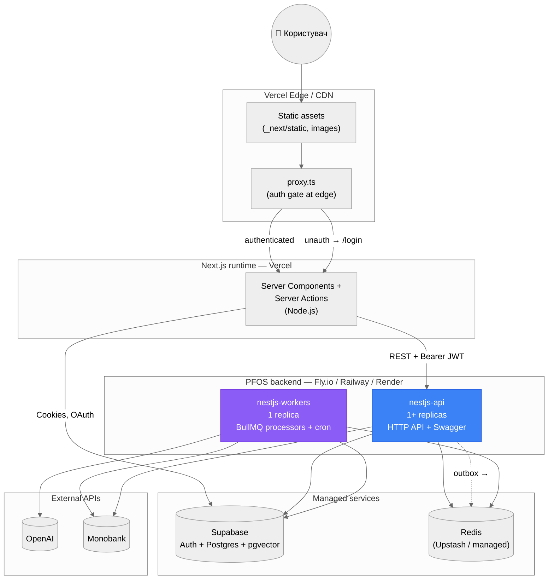

# Deployment

Target deployment topology — what runs where in production.

## Sizing recommendations (MVP)

| Component | Tier | Notes |
|---|---|---|
| Vercel | Hobby або Pro | Next.js 16, 1 region (близький до Supabase) |
| nestjs-api | 1× shared CPU, 512 MB RAM | scale-out на 2+ replicas після ~100 RPS |
| nestjs-workers | 1× shared CPU, 1 GB RAM (LLM-heavy) | НЕ scale-out поки cron-job контракт не змінено на distributed-locks |
| Supabase | Free tier для разробки, Pro для продакшну | RLS не використовується (service-role); `pg_cron` опційний |
| Redis (Upstash) | 256 MB | BullMQ + dedup keys |

## Scaling notes

1. **API process** — stateless; horizontal scaling за RPS.
2. **Workers process** — поточний код припускає **single replica** через @Cron-jobs. Якщо потрібна decentralization:
   - Винести cron jobs у окремий `scheduler` процес.
   - Worker pool скейлити по черзі (BullMQ підтримує).
   - Distributed lock (Redis) на критичні cron.
3. **OutboxPublisher** — 1 секунда polling; для high throughput замінити на `LISTEN/NOTIFY` (Postgres) + back-up polling.
4. **Postgres** — найбільш важка частина: pgvector індекси HNSW требують RAM пропорційно `m × dim × N`.
5. **OpenAI** — лімітів trigger-аware: `ai` ThrottlerGuard (10/min) на /ai/chat; cron @ 03:00 UTC consolidates пакетно.

## Observability (recommended for Phase 8)

- Logs: Pino (вже у deps) + nestjs-pino → JSON; ship to Logtail / Better Stack
- Metrics: Prometheus exporter на /metrics (BullMQ ships own); dashboards у Grafana
- Tracing: OpenTelemetry SDK + Jaeger / Honeycomb
- Cost telemetry: вбудовано — `agent_sessions.totalCostUsd` / `agent_turns.costUsd`

## Disaster recovery

- Postgres: щоденні snapshots Supabase (incl. PITR на Pro)
- Redis: BullMQ jobs не критичні (виконаються при наступному cron); dead-letter queue зберігає failed
- OutboxPublisher: at-least-once гарантія + ідемпотентні споживачі через `event_id` як dedup key
